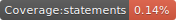
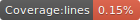

# Origin Genealogy

A family tree application written using React and D3.

Screenshot

# Installation

git clone https://github.com/srayner/origin.git
cd origin
yarn install

# Start the application

yarn start
